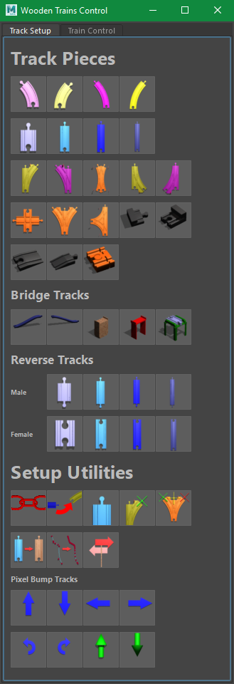
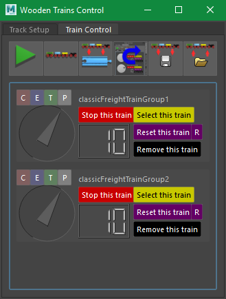

# Maya Wooden Trains 

## Summary
This project is a simple simulator of classic children's toy wooden trains that runs inside of Autodesk Maya.  This is primarily a toy to play with for its own enjoyment, although I suppose it could be used in a real animation project.  Maya is far too powerful of a tool to use for this simple of a project, but when the closest tool at hand is a hammer, everything looks like a nail...

## Eye Candy





## Getting Started
### Quickstart:
1. Set or edit the environment variable MAYA_MODULE_PATH to include the path to `woodtrains.mod`
1. Edit the `"c:\woodTrains"` inside `woodtrains.mod` to be the path to your clone or directory of `maya_woodTrains`
1. Launch Maya
1. In the Python Script Editor, run: `import woodTrainsControlPanel2 as wc; wc.main()`
1. Now you can skip down to **Usage:**

### Slower Start:
Some additional details about what's going on under the hood.

**Maya Modules**

This project uses the Maya modules system to set some paths independently of what Maya project you might be working in.  The modules system makes it easier to package up scenes, scripts, and plugins for distribution.  

Maya looks for modules on the MAYA_MODULE_PATH environment variable.  Either add the location of the directory containing `woodtrains.mod` to that variable, or copy `woodtrains.mod` to a directory that is already on that path.

`MAYA_MODULE_PATH: C:/path/to/maya_woodTrains/mayaModules`

Then when Maya launches, it should load the module, adding the relevant script, sceneFile, and icon paths.

You can place this `.mod` file anywhere that is convenient to you.  (This two-step redirection is the purpose of the modules system -- to let users add modules onto system without needing administrator access to the Maya installation path itself.)

**Editing woodtrains.mod**

Inside the `woodtrains.mod` module file, edit the path `"c:\woodTrains"` inside to be the path to your clone or directory of `maya_woodTrains`.  (You can rename and move the `maya_woodTrains` directory however you please, and just modify the `woodtrains.mod` file to match it.

**Launch Maya**
This was rewritten to work in Maya 2020, but it work in Maya 2019 and should work in any version that shipped with PySide2.

It's probably best here to set the playback range to be some really big number like 10,000 frames.

**Launch the WoodTrains Control Panel**
In the Maya Script Editor, use a python tab to run: 
```
import woodTrainsControlPanel2 as wc
wc.main()
```

## Usage

The general flow of operation for the simulation is:
1. Create some track
1. Link the track
1. Add a train
1. Reset the train onto some part of the track
1. Start the simulator

**Track Layout Tools**
- Adding Track Pieces
- Automatic Layout
  - Adjusting the current track flow direction
  - Adjusting the current Peg
- Adjusting Track position
  - "Nudging" a Track position
  - Using Maya's manipulators

## Troubleshooting
##### My track isn't linking!
##### My train isn't moving
##### My train keeps breaking into pieces
##### My train keeps reversing


## Caveats
- This is primarily a toy, not a commercial product.  There are shortcomings and pitfalls.  You're welcome to a full refund at any time.
- Like most animation tools, it works only within certain limits and boundaries.  Clearly there are track configurations that cause it to break.  That's partly why the "train reset" tools exist to be easy to use.
- Maya's performance tools try hard never to re-evaluate the same thing twice.  The script for this simulator predates most of those tools, and explicitly re-evaluates everything.  So the frame-rate performance will be slower than more modern rigs.  Maya Evaluation Manager will skip evaluating the trains.  This simulator sets the evaluation mode back to the base line `DG Mode` to force evaluation.  This will result in losing all of the performance benefit of the Evaluation Manager, Animation Caching, and other tools.
- Maya will re-use the result of a frame if it doesn't believe that anything has changed (and this simulator doesn't notify Maya that anything relevant has changed).  So it's best to set the animation playback range to an absurdly high number like 10,000 frames so that the playback never has to loop back to the same frame numbers again.  

## Under the Hood

Behind the scenes, this simulator is very simple.  At each frame an expression triggers part of the `track.py` module to move all of the trains.  Each train is some geometry and transform nodes constrained to a set of locators (one point constraint and an aim constraint for each train car).

#### Track and Parametric Curves
Each Track piece has a parametric curve embedded in it for each possible route a train can take along it.  This is usually just one route, but some tracks have several.  Each parametric curve has **Pegs** at each endpoint.  During the **Linking** process, these Pegs are associated with their neighboring Pegs.  The DAG path to the neighboring peg is stored as a string attr on peg, for each neighbor.  

Parametric curves are all directional, and some care is taken to annotate the orientation of the curve within the piece by the names of the Pegs.  Pegs will end in a 1 or a 0 denoting which end of their associated parameter curve they are located at.  (femalePegA**0**`)

The wooden interlocking element of the track geometry also carries a directionality to it (denoted by female/male peg designations), but this is only relevant to the track layout toolkit, not the simulator step. (**female**PegA0`)

Pegs also have capital letters designating which of the parameter curves they are an endpoint for (femalePeg**A**0).  For switch-tracks, this notifies the simulator to query the track among the multiple curve options (femalePeg**ABC**0).  For cross-tracks, this keeps the two independent curves separated, so an incoming train will stay on the correct path through the Track: (femalePeg**A0** <-> femalePeg**A1**,  malePeg**B0** <-> malePeg**B1**).  The **A** track Pegs stay together, and the **B** track Pegs stay together.

The simulation step for each train moves each locator by some speed/distance along its current curve.  When the needed next step would carry a locator beyond the end of its current curve, the simulator queries the **Peg** at the upcoming endpoint to see which (if any) Track piece is next.  If there is a next piece, then the locator is moved the relevant remaining distance along this new track.  (This train/track hand-off logic process is the part that I'm most proud of in this project.)

#### Linking
The **Linking** process is straightforward.  It's a quick game of "Everyone try to hold hands".  
- Make a list of every Peg in the scene and erase any pair assignments on them all.  
- Loop over each Peg, and see if there is a Peg from a _different_ track piece that is both near enough to it and wooden-peg compatible with it.  
  - If so, pair those two pegs (store their names on the other peg).  
- If there are any pegs _without_ a pair buddy, add a scene annotation marker to raise them to the attention of the user.   
  - unpaired Track Pegs are not a problem in the simulator at all.  The trains just treat them as a track terminus and reverse direction.  But unpaired Tracks frequently result from track pieces that aren't quite aligned successfully, so it's polite to inform the user in case the intent was to connect that track.
  
## FAQ
  
**BRIO, not Thomas?**
I prefer Scandinavian mid-century modern minimalism to the creepy anthropomorphism of souls trapped in transportation equipment; eternally doomed like Sisyphus to eternally orbit their island prison.  Working hard, and accomplishing nothing.  

But, to each their own.  The art assets of this project can be extended to include other trains and tracks.  
