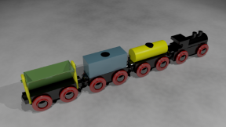
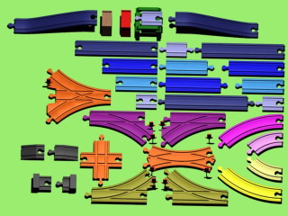
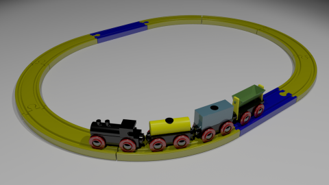

# Maya Wooden Trains 

## Summary
This project is a simple simulator of classic children's toy wooden trains that runs inside of Autodesk Maya.  This is primarily a toy to play with for its own enjoyment, although I suppose it could be used in a real animation project.  Maya is far too powerful of a tool to use for this simple of a project, but when the closest tool at hand is a hammer, everything looks like a nail...

## Eye Candy





## Getting Started
### Quickstart:
1. Set or edit the environment variable MAYA_MODULE_PATH to include the path to `woodtrains.mod`
1. Edit the `"c:\woodTrains"` inside `woodtrains.mod` to be the path to your clone or directory of `maya_woodTrains`
1. Launch Maya
1. In the Python Script Editor, run: `import woodTrainsControlPanel2 as wc; wc.main()`
1. Now you can skip down to **Usage:**

### Slower Start:
Some additional details about what's going on under the hood.

**Maya Modules**

This project uses the Maya modules system to set some paths independently of what Maya project you might be working in.  The modules system makes it easier to package up scenes, scripts, and plugins for distribution.  

Maya looks for modules on the MAYA_MODULE_PATH environment variable.  Either add the location of the directory containing `woodtrains.mod` to that variable, or copy `woodtrains.mod` to a directory that is already on that path.

`MAYA_MODULE_PATH: C:/path/to/maya_woodTrains/mayaModules`

Then when Maya launches, it should load the module, adding the relevant script, sceneFile, and icon paths.

You can place this `.mod` file anywhere that is convenient to you.  (This two-step redirection is the purpose of the modules system -- to let users add modules onto system without needing administrator access to the Maya installation path itself.)

**Editing woodtrains.mod**

Inside the `woodtrains.mod` module file, edit the path `"c:\woodTrains"` inside to be the path to your clone or directory of `maya_woodTrains`.  (You can rename and move the `maya_woodTrains` directory however you please, and just modify the `woodtrains.mod` file to match it.

**Launch Maya**
This was rewritten to work in Maya 2020, but it work in Maya 2019 and should work in any version that shipped with PySide2.

It's probably best here to set the playback range to be some really big number like 10,000 frames.

**Launch the WoodTrains Control Panel**
In the Maya Script Editor, use a python tab to run: 
```
import woodTrainsControlPanel2 as wc
wc.main()
```

## Quick Usage

The general flow of operation for the simulation is:
1. Create some track
1. Link the track
1. Add a train
1. Reset the train onto some part of the track
1. Start the simulator

## Documentation

**Detailed usage docs are over in the [Documentation](docs/docs_head.md).


